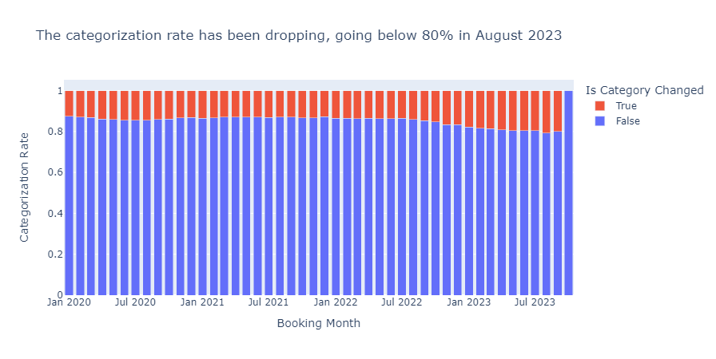
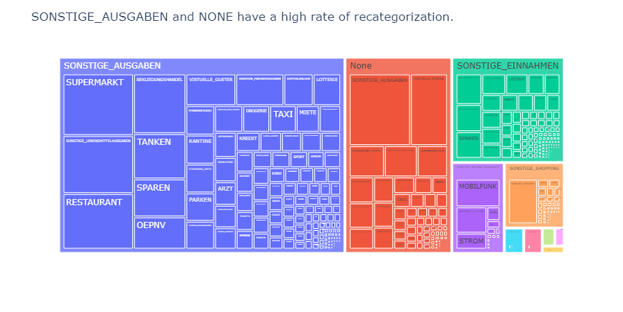
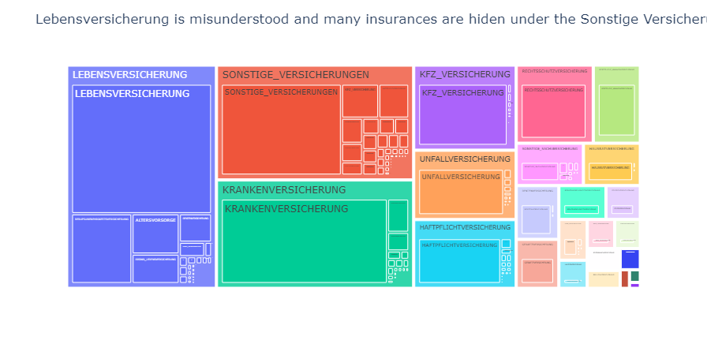

# Project Name
This project involves an in-depth analysis of transaction categories, aiming to gain insights into the instances when users opt to manually change them.

## Data
The dataset comprises mock data obtained through an interview with a financial company responsible for accessing users' bank accounts and categorizing users' transactions. The data is in a [parquet file](fg.parquet).

## Requirements
* **Data Manipulation** - pandas, numpy
* **Data Visualization** - plotly.express and plotly.graph_objects

## Key Findings

**Category Rates In Time**

**Category Changes by System and User**

**Insurance Changes by System and User**

# Conclusions
For a deeper analysis, it would be interesting to look at other information, such as:
* **country** - Does the system categorization rate have a higher percentage in the primary market, particularly in countries like Germany?
* **merchants** - Which merchants experience frequent changes in categorization, and conversely, which merchants remain relatively stable in their assigned categories?
* **mcc codes** - Are there specific categories characterized by a higher number of child categories, and do these categories demonstrate a higher likelihood of being recategorized?
* **bank** - Do certain banks provide insufficient information and therefore the categorization rate is hurt?